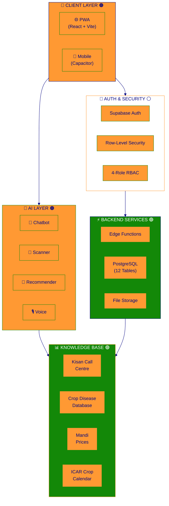
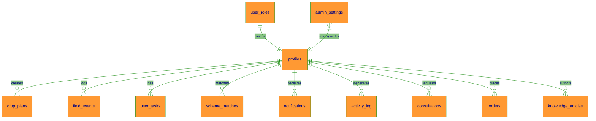

<div align="center">

<!-- 🇮🇳 Indian Flag Tricolor Top Banner -->


<!-- Animated Header -->


# 🌾 Krishi AI — Farm Intellect

### *AI-Powered Smart Agriculture Platform for Indian Farmers* 🇮🇳

<!-- Tricolor Divider -->


<p>

  

</p>

<!-- 🟠 Saffron | ⚪ White | 🟢 Green — Indian Flag Badges Row 1 -->

<p>

  <a href="https://farm-intellect-65.lovable.app/">

    

  </a>

  <a href="#-getting-started">

    

  </a>

  <a href="https://github.com/your-username/farm-intellect-65/stargazers">

    

  </a>

</p>

<!-- Tech Stack Badges - Tricolor Theme -->

<p>

  

  

  

  

  

  

  

</p>

<!-- Stats Badges - Indian Tricolor -->

<p>

  

  

  

  

  

</p>

---

<!-- 🇮🇳 Animated Tricolor Divider -->


</div>

<!-- Quick Links Navigation -->

<details open>

<summary><h2>📋 Quick Navigation</h2></summary>

| 🟠 Section | ⚪ Description |

|:--------|:------------|

| [🎯 Problem & Solution](#-the-problem-we-solve) | Why this app exists |

| [✨ Features](#-features) | What you can do |

| [📸 Screenshots](#-screenshots) | See the app in action |

| [🏗️ Architecture](#️-architecture) | How it's built |

| [👥 User Roles](#-user-roles) | Who uses what |

| [🛠️ Tech Stack](#️-tech-stack) | Technologies used |

| [🚀 Getting Started](#-getting-started) | Run it yourself |

| [📚 Knowledge Hub](#-knowledge-hub) | Learning resources |

| [🗄️ Database](#️-database-schema) | Data structure |

| [🔒 Security](#-security) | How we protect data |

| [📊 Datasets](#-datasets--knowledge-base) | Data sources |

| [🗺️ Roadmap](#️-roadmap) | What's coming next |

</details>

---

## 🎯 The Problem We Solve

<div align="center">

```

╔═════════════════════════════════════════════════════════════════╗
║  🟠🟠🟠🟠🟠🟠🟠🟠🟠🟠🟠🟠🟠🟠🟠🟠🟠🟠🟠🟠🟠🟠🟠🟠🟠🟠🟠🟠🟠🟠🟠  ║
║                    🧑‍🌾 INDIAN FARMER'S DAILY STRUGGLES          ║
║  ⚪⚪⚪⚪⚪⚪⚪⚪⚪⚪⚪⚪⚪⚪⚪⚪⚪⚪⚪⚪⚪⚪⚪⚪⚪⚪⚪⚪⚪⚪⚪  ║
╠═════════════════════════════════════════════════════════════════╣
║                                                                 ║
║   ❌ Which crop to grow?      →  No soil + season guidance      ║
║   ❌ Plant looks sick?        →  No instant diagnosis           ║
║   ❌ What's the mandi price?  →  Scattered across portals       ║
║   ❌ When to sow/harvest?     →  No personalized calendar       ║
║   ❌ Which schemes apply?     →  100+ confusing options         ║
║   ❌ Language barrier         →  Most apps are English-only     ║
║   ❌ No internet in village   →  Apps don't work offline        ║
║                                                                 ║
║  🟢🟢🟢🟢🟢🟢🟢🟢🟢🟢🟢🟢🟢🟢🟢🟢🟢🟢🟢🟢🟢🟢🟢🟢🟢🟢🟢🟢🟢🟢🟢  ║
╚═════════════════════════════════════════════════════════════════╝

                              ⬇️  🇮🇳  ⬇️

╔═════════════════════════════════════════════════════════════════╗
║  🟠🟠🟠🟠🟠🟠🟠🟠🟠🟠🟠🟠🟠🟠🟠🟠🟠🟠🟠🟠🟠🟠🟠🟠🟠🟠🟠🟠🟠🟠🟠  ║
║                    ✅ KRISHI AI SOLVES EVERYTHING               ║
║  ⚪⚪⚪⚪⚪⚪⚪⚪⚪⚪⚪⚪⚪⚪⚪⚪⚪⚪⚪⚪⚪⚪⚪⚪⚪⚪⚪⚪⚪⚪⚪  ║
╠═════════════════════════════════════════════════════════════════╣
║                                                                 ║
║   🤖 AI Crop Recommender      →  Soil + season + region based   ║
║   📸 Disease Scanner          →  Photo → instant diagnosis      ║
║   💰 Live Mandi Prices        →  All prices in one place        ║
║   📅 Smart Crop Calendar      →  Day-by-day guidance            ║
║   🏛️ Scheme Matcher           →  Find what you qualify for      ║
║   🌐 22 Languages             →  Use in your mother tongue      ║
║   📶 Works Offline            →  No internet? No problem!       ║
║                                                                 ║
║  🟢🟢🟢🟢🟢🟢🟢🟢🟢🟢🟢🟢🟢🟢🟢🟢🟢🟢🟢🟢🟢🟢🟢🟢🟢🟢🟢🟢🟢🟢🟢  ║
╚═════════════════════════════════════════════════════════════════╝

```

</div>

---

## ✨ Features

<div align="center">

### 🟠 For Farmers 🇮🇳


</div>

<table>

<tr>

<td width="50%">

### 🤖 AI-Powered Tools 🟠

| Feature | Description |

|:--------|:------------|

| 💬 **Smart Chatbot** | Ask any farming question in your language |

| 📸 **Disease Scanner** | Upload leaf photo → get diagnosis + cure |

| 🌾 **Crop Recommender** | AI suggests best crops for your soil/season |

| 🎙️ **Voice Assistant** | Speak your questions — no typing needed |

| 📈 **Yield Predictor** | Estimate harvest based on conditions |

</td>

<td width="50%">

### 📊 Intelligence & Planning 🟢

| Feature | Description |

|:--------|:------------|

| 🌤️ **Weather Alerts** | Farming-specific warnings (rain, frost, heat) |

| 💰 **Mandi Prices** | Live market prices with trends |

| 📅 **Crop Calendar** | ICAR-based sowing/irrigation/harvest schedule |

| 🗺️ **Field Map** | Visual field planning with NDVI data |

| 🏛️ **Scheme Wizard** | Check eligibility for 100+ govt schemes |

</td>

</tr>

</table>

<div align="center">

### 👨‍🔬 For Experts &nbsp;|&nbsp; 🏪 For Merchants &nbsp;|&nbsp; 🔧 For Admins

</div>

<table>

<tr>

<td width="33%" align="center">

🟠 **👨‍🔬 Agricultural Experts**

- 📋 Consultation queue

- 📚 Publish articles & guides

- 🔬 Advanced AI analysis

- 💬 Direct farmer chat

</td>

<td width="33%" align="center">

⚪ **🏪 Merchants & Traders**

- 📦 Order management

- 👥 Farmer network

- 📈 Price analytics

- 📄 Document handling

</td>

<td width="34%" align="center">

🟢 **🔧 Platform Admins**

- 👥 User management (RBAC)

- 📊 Platform analytics

- 📋 Audit logs

- ⚙️ System settings

</td>

</tr>

</table>

<div align="center">

### 🌍 Platform-Wide Capabilities

<table>

<tr>

<td align="center" bgcolor="#FF9933">

<h3>🌐</h3>

<strong>22 Languages</strong><br/>

<sub>Hindi, Punjabi, Tamil, Telugu, Bengali, Marathi, Gujarati, Kannada, Malayalam, Odia, Assamese, Urdu & more</sub>

</td>

<td align="center">

<h3>📶</h3>

<strong>Offline Mode</strong><br/>

<sub>Works without internet using IndexedDB + Service Worker caching</sub>

</td>

<td align="center">

<h3>🌙</h3>

<strong>Dark/Light Theme</strong><br/>

<sub>Eye-friendly with Indian tricolor accents</sub>

</td>

<td align="center">

<h3>📱</h3>

<strong>PWA + Mobile</strong><br/>

<sub>Install like an app or build native APK/IPA</sub>

</td>

</tr>

</table>

</div>

---

## 📸 Screenshots

<div align="center">

| 🟠 Login Screen | 🟢 Farmer Dashboard |

|:------------:|:----------------:|

|  |  |

| *4-role authentication* | *Personalized farming hub* |

</div>

---

## 🏗️ Architecture

<div align="center">



</div>

---

## 👥 User Roles

<div align="center">

| 🇮🇳 Role | Icon | Dashboard | Key Capabilities |

|:----:|:----:|:---------:|:-----------------|

| 🟠 **Farmer** | 🧑‍🌾 | Crop status, weather, AI chat | Full farming toolkit, scheme matcher, field diary |

| ⚪ **Expert** | 👨‍🔬 | Consultation queue, articles | Publish guides, resolve queries, AI analysis |

| 🟢 **Merchant** | 🏪 | Orders, farmer network | Order CRUD, market analytics, documents |

| 🔵 **Admin** | 🔧 | Platform analytics, users | Role assignment, audit logs, settings |

</div>

> 💡 **Security Note:** Roles stored in dedicated `user_roles` table with `app_role` enum — **never on profiles** (prevents privilege escalation).

---

## 🛠️ Tech Stack

<div align="center">

### Frontend 🟠

<table>

<tr>

<td align="center" width="100">

<br/>

<sub><b>React 18</b></sub>

</td>

<td align="center" width="100">

<br/>

<sub><b>TypeScript 5</b></sub>

</td>

<td align="center" width="100">

<br/>

<sub><b>Vite 5</b></sub>

</td>

<td align="center" width="100">

<br/>

<sub><b>Tailwind CSS</b></sub>

</td>

<td align="center" width="100">

<br/>

<sub><b>shadcn/ui</b></sub>

</td>

</tr>

</table>

### Backend & Infrastructure 🟢

<table>

<tr>

<td align="center" width="100">

<br/>

<sub><b>Supabase</b></sub>

</td>

<td align="center" width="100">

<br/>

<sub><b>PostgreSQL</b></sub>

</td>

<td align="center" width="100">

<br/>

<sub><b>Vercel</b></sub>

</td>

<td align="center" width="100">

<br/>

<sub><b>Gemini AI</b></sub>

</td>

<td align="center" width="100">

<br/>

<sub><b>Capacitor</b></sub>

</td>

</tr>

</table>

</div>

---

## 🚀 Getting Started

<details open>

<summary><h3>⚡ Quick Start (2 minutes) 🟠</h3></summary>

```bash

# 🟠 Clone the repository

git clone https://github.com/your-username/farm-intellect-65.git

# ⚪ Navigate to project

cd farm-intellect-65

# 🟢 Install dependencies

npm install

# 🇮🇳 Start development server

npm run dev

```

🎉 Open `http://localhost:8080` in your browser!

</details>

<details>

<summary><h3>📱 Mobile App Build (Android/iOS) ⚪</h3></summary>

```bash

# Add platforms

npx cap add android

npx cap add ios

# Build and sync

npm run build

npx cap sync

# Open in IDE

npx cap open android    # → Android Studio

npx cap open ios        # → Xcode (Mac only)

```

> 📦 **Build APK:** Android Studio → Build → Build Bundle/APK → Build APK

</details>

<details>

<summary><h3>🌐 PWA Installation 🟢</h3></summary>

| Platform | Steps |

|:---------|:------|

| **Android** | Chrome → Menu (⋮) → "Add to Home Screen" |

| **iOS** | Safari → Share (📤) → "Add to Home Screen" |

| **Desktop** | Click install icon in address bar |

</details>

---

## 📚 Knowledge Hub

<div align="center">

> 🎓 **Your Learning Center** — Podcasts, Videos, Infographics, and Slides

| Content Type | Description | Location |

|:-------------|:------------|:---------|

| 🎧 **Podcasts** | AI-generated audio episodes about farming | `/farmer/knowledge` → Podcasts tab |

| 🖼️ **Infographics** | Visual guides and diagrams | `/farmer/knowledge` → Infographics tab |

| 📄 **Slides** | Downloadable PDF presentations | `/farmer/knowledge` → Slides tab |

| 🎬 **Videos** | Educational farming videos | `/farmer/knowledge` → Videos tab |

**Direct Access:** [farm-intellect-65.lovable.app/farmer/knowledge](https://farm-intellect-65.lovable.app/farmer/knowledge)

</div>

---

## 🗄️ Database Schema

<div align="center">



</div>

<details>

<summary><h4>📋 Table Details</h4></summary>

| 🇮🇳 Table | Purpose | RLS |

|:------|:--------|:---:|

| 🟠 `profiles` | User profiles linked to auth | ✅ |

| ⚪ `user_roles` | RBAC roles (farmer/expert/merchant/admin) | ✅ |

| 🟢 `crop_plans` | Farmer crop planning | ✅ |

| 🟠 `field_events` | Field history timeline | ✅ |

| ⚪ `user_tasks` | Task/reminder management | ✅ |

| 🟢 `scheme_matches` | Government scheme eligibility | ✅ |

| 🟠 `consultations` | Expert-farmer consultations | ✅ |

| ⚪ `orders` | Merchant-farmer orders | ✅ |

| 🟢 `knowledge_articles` | Expert-published articles | ✅ |

| 🟠 `notifications` | System notifications | ✅ |

| ⚪ `activity_log` | Audit trail | ✅ |

| 🟢 `admin_settings` | Platform configuration | ✅ |

</details>

---

## 🔒 Security

<div align="center">

| 🇮🇳 Layer | Implementation |

|:------|:---------------|

| 🟠 **Authentication** | Supabase Auth with email verification |

| ⚪ **Authorization** | 4-role RBAC via `user_roles` + `has_role()` security definer |

| 🟢 **Data Protection** | Row-Level Security on all 12 tables |

| 🟠 **API Security** | JWT verification on Edge Functions |

| ⚪ **Input Validation** | Zod schemas + server-side validation |

| 🟢 **Password Safety** | HIBP leaked password check (configurable) |

| 🔵 **Cross-Role Protection** | Farmers can't access admin routes; merchants can't access expert data |

</div>

---

## 📊 Datasets & Knowledge Base

<div align="center">

> 📚 **All data from verified Indian government and research sources** 🇮🇳

| Dataset | Source | Records |

|:--------|:-------|:--------|

| 🦠 Crop Diseases | ICAR, CABI | 50+ diseases |

| 🐛 Pest Database | NCIPM, IPM guides | 40+ pests |

| 📅 Crop Calendar | ICAR-CRIDA | 15+ crops |

| 💰 Mandi Prices | Agmarknet | Real-time |

| 📞 Kisan Call Centre | KCC transcripts | 100+ FAQs |

| 🌱 Soil Health | Soil Health Card | Reference params |

| 🛰️ Satellite/NDVI | Sentinel Hub | Vegetation thresholds |

</div>

---

## 🗺️ Roadmap

<div align="center">

| Status | Feature |

|:------:|:--------|

| ✅ 🟢 | 4-role RBAC with Supabase Auth |

| ✅ 🟢 | AI Chatbot with Kisan Call Centre knowledge |

| ✅ 🟢 | Crop Disease Scanner |

| ✅ 🟢 | 22-language support |

| ✅ 🟢 | PWA with offline caching |

| ✅ 🟢 | Native mobile via Capacitor |

| ✅ 🟢 | Expert Knowledge Hub (CRUD) |

| ✅ 🟢 | Knowledge Hub (Podcasts, Videos, Infographics, Slides) |

| ✅ 🟢 | IndexedDB offline sync |

| 🔜 🟠 | Push notifications via FCM |

| 🔜 🟠 | Drone/IoT sensor integration |

| 🔜 🟠 | Blockchain crop traceability |

| 🔜 🟠 | WhatsApp bot integration |

| 🔜 🟠 | Regional weather SMS alerts |

</div>

---

## ⭐ Support This Project

<div align="center">

> **No money needed!** Just give us a ⭐ star — it helps Indian farmers discover this free tool! 🇮🇳

<a href="https://github.com/samrudh/farm-intellect-65/stargazers">

  

</a>

**Why star?**

- 🟠 Helps other farmers & developers find this project

- ⚪ Shows the community believes in digital agriculture

- 🟢 Motivates continued development — 100% free forever

</div>

---

## 🤝 Contributing

<div align="center">

We welcome contributions! See our detailed [CONTRIBUTING.md](CONTRIBUTING.md) guide.

1. 🍴 Fork the repository

2. 🟠 Create feature branch (`git checkout -b feature/amazing-feature`)

3. ⚪ Commit changes (`git commit -m 'Add amazing feature'`)

4. 🟢 Push to branch (`git push origin feature/amazing-feature`)

5. 🔄 Open Pull Request

</div>

---

## 📄 License

<div align="center">

**© 2025 Samrudh. All Rights Reserved.** 🇮🇳

This project is created for educational and agricultural empowerment purposes.

---

<!-- 🇮🇳 Indian Flag Tricolor Wave Footer -->


<p>

  <strong>🟠 Made with ❤️ for Indian Farmers 🌾🇮🇳 🟢</strong>

</p>

<p>

  <a href="https://farm-intellect-65.lovable.app/">

    

  </a>

  &nbsp;

  <a href="https://github.com/samrudh/farm-intellect-65/stargazers">

    

  </a>

</p>

<!-- 🟠⚪🟢 Vande Mataram 🇮🇳 -->

<sub>🟠 Saffron — Courage & Sacrifice &nbsp;|&nbsp; ⚪ White — Peace & Truth &nbsp;|&nbsp; 🟢 Green — Faith & Fertility</sub>

</div>
