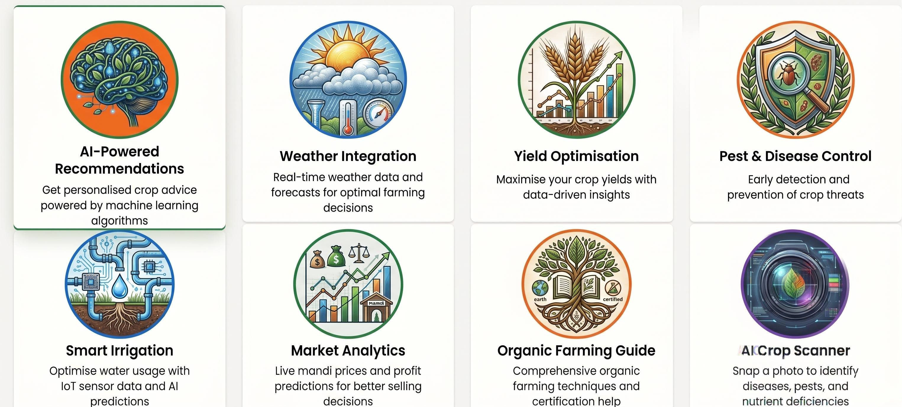
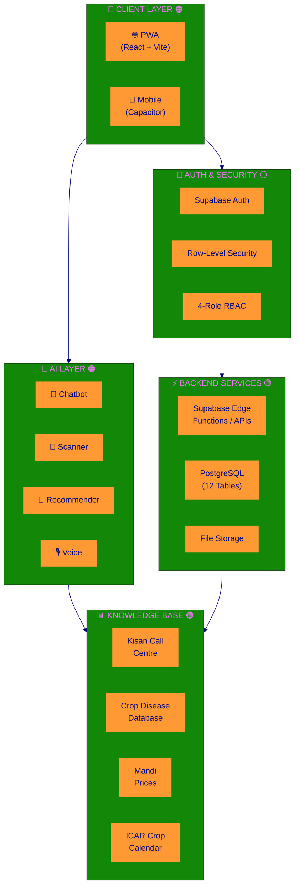
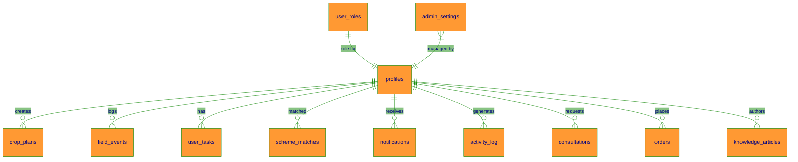

<div align="center">


# 🌾 Krishi AI — Farm Intellect

### *AI-powered smart agriculture platform for Indian farmers* 🇮🇳

[](https://farm-intellect-65.lovable.app/)
[](#-getting-started)
[](https://github.com/Samrudh2006/farm-intellect-65/stargazers)


</div>

---

## 📋 Quick Navigation

| Section | Description |
| --- | --- |
| [🎯 Problem & Solution](#-the-problem-we-solve) | Why this app exists |
| [✨ Features](#-features) | Key product capabilities |
| [📸 Screenshots](#-screenshots) | Product visuals |
| [🏗️ Architecture](#️-architecture) | System overview |
| [👥 User Roles](#-user-roles) | Role-based workflows |
| [🛠️ Tech Stack](#️-tech-stack) | Frontend, backend, and tooling |
| [🚀 Getting Started](#-getting-started) | Local setup |
| [📚 Knowledge Hub](#-knowledge-hub) | Learning resources |
| [🗄️ Database Schema](#️-database-schema) | Core tables |
| [🔒 Security](#-security) | Security controls |
| [📊 Datasets](#-datasets--knowledge-base) | Data sources |
| [🗺️ Roadmap](#️-roadmap) | Upcoming work |

---

## 🎯 The Problem We Solve

| Farmer problems | What Krishi AI provides |
| --- | --- |
| ❌ Which crop should I grow? | ✅ AI crop recommendations based on soil, season, and region |
| ❌ Plant looks sick? | ✅ Photo-based disease diagnosis with suggested cures |
| ❌ What is the mandi price today? | ✅ Consolidated market price visibility |
| ❌ When should I sow or harvest? | ✅ Crop calendar and timely guidance |
| ❌ Which government schemes apply to me? | ✅ Scheme eligibility support |
| ❌ Most apps are English-only | ✅ Support for 22 languages |
| ❌ Internet is unreliable in villages | ✅ Offline-friendly PWA experience |

---

## ✨ Features

### 🧑‍🌾 Farmer experience

| Feature area | Included capabilities |
| --- | --- |
| 🤖 AI-powered tools | Smart chatbot, disease scanner, crop recommender, voice assistant, yield insights |
| 📊 Planning & intelligence | Weather alerts, mandi prices, crop calendar, field map, scheme wizard |
| 📱 Accessibility | PWA install, offline access, multilingual UI, dark/light theme |

### 👥 Role-based workflows

| Role | Key capabilities |
| --- | --- |
| 👨‍🔬 Experts | Consultation queue, article publishing, advanced analysis, direct farmer support |
| 🏪 Merchants | Order management, farmer network, price analytics, document handling |
| 🔧 Admins | User management, analytics, audit logs, system settings |

### 🌍 Platform-wide capabilities

| Capability | Description |
| --- | --- |
| 🌐 22 Languages | Hindi, Punjabi, Tamil, Telugu, Bengali, Marathi, Gujarati, Kannada, Malayalam, Odia, Assamese, Urdu, and more |
| 📶 Offline Mode | IndexedDB and service-worker caching keep the app useful with limited connectivity |
| 🌙 Adaptive UI | Dark and light themes with tricolor styling |
| 📱 PWA + Mobile | Installable web app with Capacitor mobile support |

---

## 📸 Screenshots

| Login | Product overview |
| --- | --- |
|  |  |
| Secure 4-role sign-in flow | Snapshot of the product experience |

---

## 🏗️ Architecture



---

## 👥 User Roles

| Role | Dashboard focus | Key capabilities |
| --- | --- | --- |
| 🧑‍🌾 Farmer | Crop status, weather, AI assistant | Full farming toolkit, scheme matcher, field diary |
| 👨‍🔬 Expert | Consultation queue, articles | Publish guides, resolve queries, support farmers |
| 🏪 Merchant | Orders, farmer network | Order management, analytics, document workflows |
| 🔧 Admin | Platform analytics, users | Role assignment, audit logs, platform settings |

> 💡 Roles are stored in the dedicated `user_roles` table with an `app_role` enum rather than on profiles.

---

## 🛠️ Tech Stack

### Frontend

| Area | Stack |
| --- | --- |
| App shell | React 18, TypeScript, Vite |
| UI | Tailwind CSS, shadcn/ui, Radix UI |
| Routing & state | React Router, TanStack Query |
| Mobile | Capacitor |

### Backend & infrastructure

| Area | Stack |
| --- | --- |
| Backend platform | Supabase, PostgreSQL |
| Authentication | Supabase Auth |
| Hosting | Vercel |
| AI integrations | App-specific AI services and voice flows |

---

## 🚀 Getting Started

### Quick start

```bash
git clone https://github.com/Samrudh2006/farm-intellect-65.git
cd farm-intellect-65
npm install
npm run dev
```

Open `http://localhost:8080` in your browser.

### Mobile app build

```bash
npx cap add android
npx cap add ios
npm run build
npx cap sync
npx cap open android
npx cap open ios
```

### PWA installation

| Platform | Steps |
| --- | --- |
| Android | Chrome → Menu (⋮) → Add to Home Screen |
| iOS | Safari → Share → Add to Home Screen |
| Desktop | Click the install icon in the address bar |

---

## 📚 Knowledge Hub

> Podcasts, videos, infographics, and slides are available from the farmer knowledge experience.

| Content type | Description | Access |
| --- | --- | --- |
| 🎧 Podcasts | AI-generated farming audio episodes | `/farmer/knowledge` → Podcasts |
| 🖼️ Infographics | Visual farming guides and diagrams | `/farmer/knowledge` → Infographics |
| 📄 Slides | Downloadable learning presentations | `/farmer/knowledge` → Slides |
| 🎬 Videos | Educational farming videos | `/farmer/knowledge` → Videos |

**Direct link:** [farm-intellect-65.lovable.app/farmer/knowledge](https://farm-intellect-65.lovable.app/farmer/knowledge)

---

## 🗄️ Database Schema



| Table | Purpose | RLS |
| --- | --- | --- |
| `profiles` | User profiles linked to auth | ✅ |
| `user_roles` | RBAC roles for farmer, expert, merchant, and admin | ✅ |
| `crop_plans` | Farmer crop planning | ✅ |
| `field_events` | Field history timeline | ✅ |
| `user_tasks` | Task and reminder management | ✅ |
| `scheme_matches` | Government scheme eligibility | ✅ |
| `consultations` | Expert-farmer consultations | ✅ |
| `orders` | Merchant-farmer orders | ✅ |
| `knowledge_articles` | Expert-published articles | ✅ |
| `notifications` | System notifications | ✅ |
| `activity_log` | Audit trail | ✅ |
| `admin_settings` | Platform configuration | ✅ |

---

## 🔒 Security

| Layer | Implementation |
| --- | --- |
| Authentication | Supabase Auth with email verification |
| Authorization | 4-role RBAC via `user_roles` and `has_role()` |
| Data protection | Row-Level Security on core tables |
| API security | JWT verification for protected backend flows |
| Input validation | Zod schemas and server-side validation |
| Password safety | HIBP leaked-password check support |
| Cross-role protection | Route and data boundaries between farmer, expert, merchant, and admin experiences |

---

## 📊 Datasets & Knowledge Base

| Dataset | Source | Coverage |
| --- | --- | --- |
| Crop diseases | ICAR, CABI | 50+ diseases |
| Pest database | NCIPM, IPM guides | 40+ pests |
| Crop calendar | ICAR-CRIDA | 15+ crops |
| Mandi prices | Agmarknet | Real-time data |
| Kisan Call Centre knowledge | KCC transcripts | 100+ FAQs |
| Soil health | Soil Health Card | Reference parameters |
| Satellite / NDVI | Sentinel Hub | Vegetation thresholds |

---

## 🗺️ Roadmap

| Status | Feature |
| --- | --- |
| ✅ | 4-role RBAC with Supabase Auth |
| ✅ | AI chatbot with Kisan Call Centre knowledge |
| ✅ | Crop disease scanner |
| ✅ | 22-language support |
| ✅ | PWA with offline caching |
| ✅ | Native mobile app support via Capacitor |
| ✅ | Expert Knowledge Hub CRUD |
| ✅ | Knowledge Hub for podcasts, videos, infographics, and slides |
| ✅ | IndexedDB offline sync |
| 🔜 | Push notifications via FCM |
| 🔜 | Drone / IoT sensor integration |
| 🔜 | Blockchain crop traceability |
| 🔜 | WhatsApp bot integration |
| 🔜 | Regional weather SMS alerts |

---

## ⭐ Support This Project

If you find this project useful, please give it a star:

[](https://github.com/Samrudh2006/farm-intellect-65/stargazers)

---

## 🤝 Contributing

We welcome contributions. Please review [CONTRIBUTING.md](CONTRIBUTING.md) before opening a pull request.

1. Fork the repository.
2. Create a feature branch.
3. Commit your changes.
4. Push your branch.
5. Open a pull request.

---

## 📄 License

**© 2025 Samrudh. All rights reserved.**

This project is created for educational and agricultural empowerment purposes.

<div align="center">


**🟠 Made with ❤️ for Indian farmers 🌾🇮🇳 🟢**

[](https://farm-intellect-65.lovable.app/)
[](https://github.com/Samrudh2006/farm-intellect-65/stargazers)

<sub>🟠 Saffron — Courage & Sacrifice &nbsp;|&nbsp; ⚪ White — Peace & Truth &nbsp;|&nbsp; 🟢 Green — Faith & Fertility</sub>

</div>
