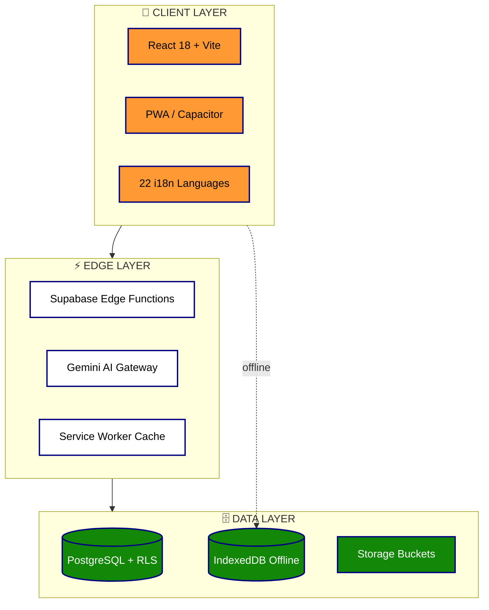

<!--
  🌾 KRISHI AI — FARM INTELLECT
  Advanced animated GitHub README
  Theme: Indian Tricolour (Saffron #FF9933 · White #FFFFFF · Green #138808 · Navy #000080)
  Author: Samrudh
-->

<div align="center">

<a href="#">
  
</a>

<a href="#">
  
</a>

<br/>

<p>
  
  
  
  
</p>

<p>
  
  
  
  
</p>


</div>

---

## 📋 Quick Navigation

<div align="center">

| 🎯 [Problem](#-the-problem-we-solve) | ✨ [Features](#-features) | 📸 [Screenshots](#-screenshots) | 🏗️ [Architecture](#-architecture) | 👥 [Roles](#-user-roles) |
|:---:|:---:|:---:|:---:|:---:|
| 🛠️ **[Tech Stack](#-tech-stack)** | 🚀 **[Getting Started](#-getting-started)** | 📚 **[Knowledge Hub](#-knowledge-hub)** | 🗄️ **[Database](#-database-schema)** | 🔒 **[Security](#-security)** |
| 📊 **[Datasets](#-datasets--knowledge-base)** | 🗺️ **[Roadmap](#-roadmap)** | 🤝 **[Contributing](#-contributing)** | ⭐ **[Support](#-support-this-project)** | 📄 **[License](#-license)** |

</div>

---

## 🎯 The Problem We Solve

<table>
<tr>
<td width="50%" valign="top">

### ❌ Farmer's Daily Struggles
```diff
- 🌱 Which crop to grow this season?
- 🦠 Plant looks sick — what is it?
- 💰 What's today's mandi price?
- 📅 When to sow / irrigate / harvest?
- 🏛️ Which govt schemes apply to me?
- 🌐 Apps are only in English
- 📶 No internet in my village
```

</td>
<td width="50%" valign="top">

### ✅ Krishi AI Solves It
```diff
+ 🤖 AI Crop Recommender (soil + season)
+ 📸 Photo → instant disease diagnosis
+ 💰 Live mandi prices in one place
+ 📅 Day-by-day smart crop calendar
+ 🏛️ Scheme matcher for 100+ schemes
+ 🌐 22 Indian languages
+ 📶 Works fully offline (PWA)
```

</td>
</tr>
</table>

---

## ✨ Features

### 🧑‍🌾 For Farmers

<table>
<tr>
<td width="33%" align="center">
<br/>
<b>🤖 AI Chatbot</b><br/>
<sub>Ask any farming question in your mother tongue</sub>
</td>
<td width="33%" align="center">
<br/>
<b>📸 Disease Scanner</b><br/>
<sub>Upload leaf photo → diagnosis + cure</sub>
</td>
<td width="33%" align="center">
<br/>
<b>🌾 Crop Recommender</b><br/>
<sub>Best crops for your soil & season</sub>
</td>
</tr>
<tr>
<td align="center">
<br/>
<b>🎙️ Voice Assistant</b><br/>
<sub>Speak — no typing needed</sub>
</td>
<td align="center">
<br/>
<b>📈 Yield Predictor</b><br/>
<sub>Estimate harvest before sowing</sub>
</td>
<td align="center">
<br/>
<b>🌤️ Weather Alerts</b><br/>
<sub>Rain, frost & heat warnings</sub>
</td>
</tr>
<tr>
<td align="center">
<br/>
<b>💰 Live Mandi Prices</b><br/>
<sub>Real-time market rates + trends</sub>
</td>
<td align="center">
<br/>
<b>📅 Crop Calendar</b><br/>
<sub>ICAR-based daily guidance</sub>
</td>
<td align="center">
<br/>
<b>🏛️ Scheme Wizard</b><br/>
<sub>Check eligibility for 100+ schemes</sub>
</td>
</tr>
</table>

### 👨‍🔬 For Experts • 🏪 For Merchants • 🔧 For Admins

<details>
<summary><b>👨‍🔬 Agricultural Experts</b> — click to expand</summary>

- 📋 Consultation queue & ticketing
- 📚 Publish articles, guides & podcasts
- 🔬 Advanced AI-assisted analysis tools
- 💬 Direct chat with farmers

</details>

<details>
<summary><b>🏪 Merchants & Traders</b> — click to expand</summary>

- 📦 Full order management (CRUD)
- 👥 Farmer network & relationships
- 📈 Price analytics & forecasting
- 📄 Document handling & invoices

</details>

<details>
<summary><b>🔧 Platform Admins</b> — click to expand</summary>

- 👥 User management with full RBAC
- 📊 Platform-wide analytics dashboard
- 📋 Immutable audit logs
- ⚙️ System & feature flag settings

</details>

### 🌍 Platform-Wide Capabilities

<div align="center">

| 🌐 **22 Languages** | 📶 **Offline Mode** | 🌙 **Dark / Light** | 📱 **PWA + Native** |
|:---:|:---:|:---:|:---:|
| Hindi, Punjabi, Tamil, Telugu, Bengali, Marathi & more | IndexedDB + Service Worker caching | Eye-friendly with tricolour accents | Install like app or build APK/IPA |

</div>

---

## 📸 Screenshots

<div align="center">

| 🔐 Login Screen | 🧑‍🌾 Farmer Dashboard |
|:---:|:---:|
|  |  |
| 4-role authentication | Personalised farming hub |

> 💡 Replace these placeholders with real screenshots from `/docs/screenshots/`

</div>

---

## 🏗️ Architecture



---

## 👥 User Roles

| Role | Icon | Dashboard | Key Capabilities |
|------|:---:|-----------|------------------|
| **Farmer** | 🧑‍🌾 | Crop status, weather, AI chat | Full farming toolkit, scheme matcher, field diary |
| **Expert** | 👨‍🔬 | Consultation queue, articles | Publish guides, resolve queries, AI analysis |
| **Merchant** | 🏪 | Orders, farmer network | Order CRUD, market analytics, documents |
| **Admin** | 🔧 | Platform analytics, users | Role assignment, audit logs, settings |

> 🔐 **Security Note:** Roles stored in dedicated `user_roles` table with `app_role` enum — **never on profiles** (prevents privilege escalation).

---

## 🛠️ Tech Stack

<div align="center">

### Frontend
<p>
  
</p>


### Backend & Infrastructure
<p>
  
</p>


</div>

---

## 🚀 Getting Started

### ⚡ Quick Start (2 minutes)

```bash
# 1️⃣ Clone the repository
git clone https://github.com/samrudh/farm-intellect-65.git

# 2️⃣ Navigate to project
cd farm-intellect-65

# 3️⃣ Install dependencies
npm install

# 4️⃣ Copy environment template
cp .env.example .env

# 5️⃣ Start development server
npm run dev
```

🎉 Open **http://localhost:8080** and you'll see the app!

### 📱 Mobile Build (Android / iOS)

```bash
npx cap add android && npx cap add ios
npm run build && npx cap sync
npx cap open android    # Android Studio
npx cap open ios        # Xcode (Mac only)
```

📦 **Build APK:** Android Studio → Build → Build Bundle / APK

### 🌐 PWA Install

| Platform | Steps |
|----------|-------|
| **Android** | Chrome → ⋮ Menu → *Add to Home Screen* |
| **iOS** | Safari → 📤 Share → *Add to Home Screen* |
| **Desktop** | Click install icon in address bar |

---

## 📚 Knowledge Hub

> 🎓 **Your Learning Center** — Podcasts, Videos, Infographics, and Slides

| Type | Description | Location |
|------|-------------|----------|
| 🎧 **Podcasts** | AI-generated audio episodes | `/farmer/knowledge → Podcasts` |
| 🖼️ **Infographics** | Visual guides & diagrams | `/farmer/knowledge → Infographics` |
| 📄 **Slides** | Downloadable PDF decks | `/farmer/knowledge → Slides` |
| 🎬 **Videos** | Educational farming videos | `/farmer/knowledge → Videos` |

🔗 **Direct Access:** `farm-intellect-65.lovable.app/farmer/knowledge`

---

## 🗄️ Database Schema

<details>
<summary><b>📋 Click to view all 12 tables</b></summary>

| Table | Purpose | RLS |
|-------|---------|:---:|
| `profiles` | User profiles linked to auth | ✅ |
| `user_roles` | RBAC roles (farmer/expert/merchant/admin) | ✅ |
| `crop_plans` | Farmer crop planning | ✅ |
| `field_events` | Field history timeline | ✅ |
| `user_tasks` | Task & reminder management | ✅ |
| `scheme_matches` | Government scheme eligibility | ✅ |
| `consultations` | Expert ↔ farmer consultations | ✅ |
| `orders` | Merchant ↔ farmer orders | ✅ |
| `knowledge_articles` | Expert-published content | ✅ |
| `notifications` | System notifications | ✅ |
| `activity_log` | Audit trail | ✅ |
| `admin_settings` | Platform configuration | ✅ |

</details>

---

## 🔒 Security

| Layer | Implementation |
|-------|----------------|
| 🔐 **Authentication** | Supabase Auth with email verification |
| 👥 **Authorization** | 4-role RBAC via `user_roles` + `has_role()` security definer |
| 🛡️ **Data Protection** | Row-Level Security on all 12 tables |
| 🔑 **API Security** | JWT verification on all Edge Functions |
| ✅ **Input Validation** | Zod schemas + server-side validation |
| 🚫 **Password Safety** | HIBP leaked-password check |
| 🔒 **Cross-Role** | Farmers can't access admin routes (and vice-versa) |

🚨 **Found a vulnerability?** See [SECURITY.md](./SECURITY.md) for responsible disclosure.

---

## 📊 Datasets & Knowledge Base

> 📚 All data sourced from verified **Indian government** and **research** sources

| Dataset | Source | Records |
|---------|--------|---------|
| 🦠 Crop Diseases | ICAR, CABI | 50+ |
| 🐛 Pest Database | NCIPM, IPM guides | 40+ |
| 📅 Crop Calendar | ICAR-CRIDA | 15+ crops |
| 💰 Mandi Prices | Agmarknet | Real-time |
| 📞 Kisan Call Centre | KCC transcripts | 100+ FAQs |
| 🌱 Soil Health | Soil Health Card | Reference params |
| 🛰️ Satellite / NDVI | Sentinel Hub | Vegetation thresholds |

---

## 🗺️ Roadmap

```text
✅ Shipped                                    🔜 Coming Soon
─────────────────────────                     ─────────────────────────
[x] 4-role RBAC + Supabase Auth               [ ] Push notifications (FCM)
[x] AI Chatbot (KCC knowledge)                [ ] Drone / IoT sensors
[x] Crop Disease Scanner                      [ ] Blockchain traceability
[x] 22-language support                       [ ] WhatsApp bot integration
[x] PWA + offline caching                     [ ] Regional SMS weather alerts
[x] Native mobile via Capacitor               [ ] AR field visualisation
[x] Expert Knowledge Hub (CRUD)               [ ] Voice-only kiosk mode
[x] IndexedDB offline sync                    [ ] Carbon credit marketplace
```

---

## ⭐ Support This Project

<div align="center">

### 💚 No money needed — just a ⭐ helps Indian farmers discover this free tool!

<a href="https://github.com/samrudh/farm-intellect-65">
  
</a>

**Why star?**

🔍 Helps other farmers & devs find this · 📈 Shows the community believes in digital agriculture · 💚 Motivates continued development (100% free forever)

</div>

---

## 🤝 Contributing

We welcome contributions! See [CONTRIBUTING.md](./CONTRIBUTING.md) for the full guide.

```bash
🍴 Fork  →  🌿 Branch  →  ✏️ Code  →  🧪 Test  →  💾 Commit  →  🔄 PR
```

```bash
git checkout -b feature/amazing-feature
git commit -m "feat: add amazing feature for Punjab farmers"
git push origin feature/amazing-feature
```

---

## 📄 License

```
© 2025 Samrudh. All Rights Reserved.
Proprietary Software License — see LICENSE for full terms.
This project is created for educational and agricultural empowerment purposes.
```

---

<div align="center">

### 🌾 Made with ❤️ for Indian Farmers 🇮🇳


<sub>Building technology for Indian agriculture — together. 🌾🤝</sub>

</div>
