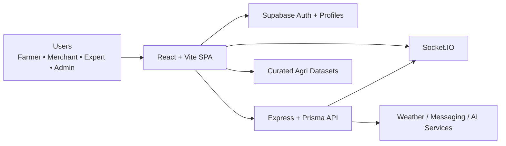

# Farm Intellect

Farm Intellect is a multi-role agricultural intelligence platform that combines a React frontend, a Node/Express backend, curated agronomy datasets, and AI-assisted workflows for farmers, merchants, experts, and administrators.

## What this project includes

- **Farmer workflows** for advisory, crop planning, weather, sensors, field mapping, documents, chat, forums, knowledge hubs, and AI-assisted support
- **Merchant workflows** for farmer discovery, market prices, orders, chat, documents, and notifications
- **Expert workflows** for AI crop scanning, AI advisory, consultations, chat, and knowledge-sharing
- **Admin workflows** for user management, analytics, audit activity, notifications, SMS, and settings
- **Hybrid intelligence model** that blends frontend datasets, Supabase identity flows, and protected backend APIs
- **PWA-ready frontend** with install flow, app launcher routing, push notifications, and multilingual UX support

## Architecture at a glance



## Core stack

| Layer | Technology |
| --- | --- |
| Frontend | React 18, Vite, TypeScript, React Router, TanStack Query, Tailwind |
| Backend | Node.js, Express, Prisma, Socket.IO |
| Auth / profile | Supabase |
| Testing | Vitest, Testing Library, Supertest |
| Packaging | npm with a single root lockfile |
| Deployment targets | Static frontend + Node backend |

## Repository layout

```text
farm-intellect-65/
├── src/          # Frontend application, routes, components, datasets, hooks
├── backend/      # Express API, Prisma, middleware, backend tests
├── docs/         # Architecture, deployment, testing, security, data docs
├── public/       # PWA assets, manifest, service worker, public files
├── supabase/     # Supabase config, migrations, edge functions
└── scripts/      # Project utility scripts
```

## Product capabilities

### Farmer experience
- crop recommendations and seasonal planning
- AI advisory and crop disease scanning
- weather, soil, and field intelligence
- community chat, forum, and knowledge access
- document and notification workflows

### Merchant experience
- farmer network views
- mandi and market intelligence
- order coordination and messaging
- operational documents and notifications

### Expert and admin experience
- expert advisory, consultation, and scanner tools
- admin analytics, audit log, SMS, and settings
- shared protected routes with role-aware access control

## Getting started

### 1. Install dependencies

```bash
npm ci
cd backend && npm ci
```

### 2. Configure environment files

Frontend:

```bash
cp .env.example .env
```

Backend:

```bash
cd backend
cp .env.example .env
```

Important config notes:

- only public-safe browser values belong in the root `.env`
- secrets and provider credentials belong in `backend/.env`
- production builds should set `VITE_ROBOTS_POLICY=index, follow`
- preview or staging builds should keep `VITE_ROBOTS_POLICY=noindex, nofollow`

### 3. Run the apps

Frontend:

```bash
npm run dev
```

Backend:

```bash
cd backend
npm run dev
```

## Validation

Frontend:

```bash
npm run lint
npm run test
npm run build
```

Backend:

```bash
cd backend
npm run test
```

## Documentation guide

- [Architecture overview](docs/architecture.md)
- [App structure](docs/app-structure.md)
- [System design](docs/system-design.md)
- [Testing guide](docs/testing.md)
- [Deployment guide](docs/deployment.md)
- [Security documentation](docs/security.md)
- [Datasets guide](docs/datasets.md)
- [Service boundaries](docs/service-boundaries.md)
- [Contribution guide](CONTRIBUTING.md)
- [Security policy](SECURITY.md)

## Engineering notes

- the frontend is a Vite + React Router SPA, not a Next.js app
- the backend follows Prisma migration-first workflows
- the platform uses a hybrid architecture intentionally: dataset-driven UX, Supabase identity, and custom backend operations each have distinct responsibilities

## Why this README is organized this way

This repository has broad scope, multiple user roles, and several supporting documents. This README is meant to be the fast executive entry point, while the `docs/` directory remains the source of truth for deeper architecture, operations, testing, and deployment details.
